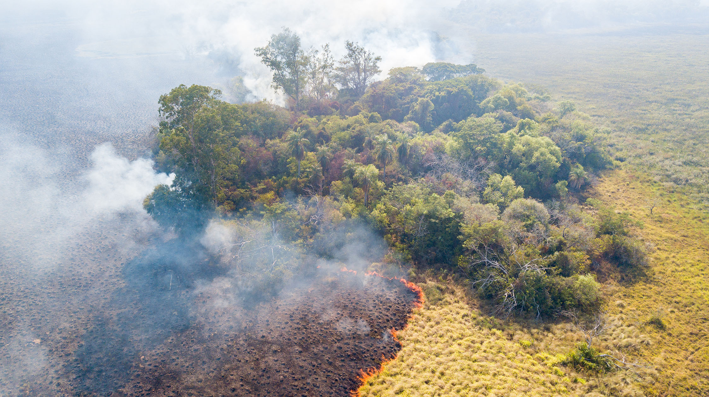
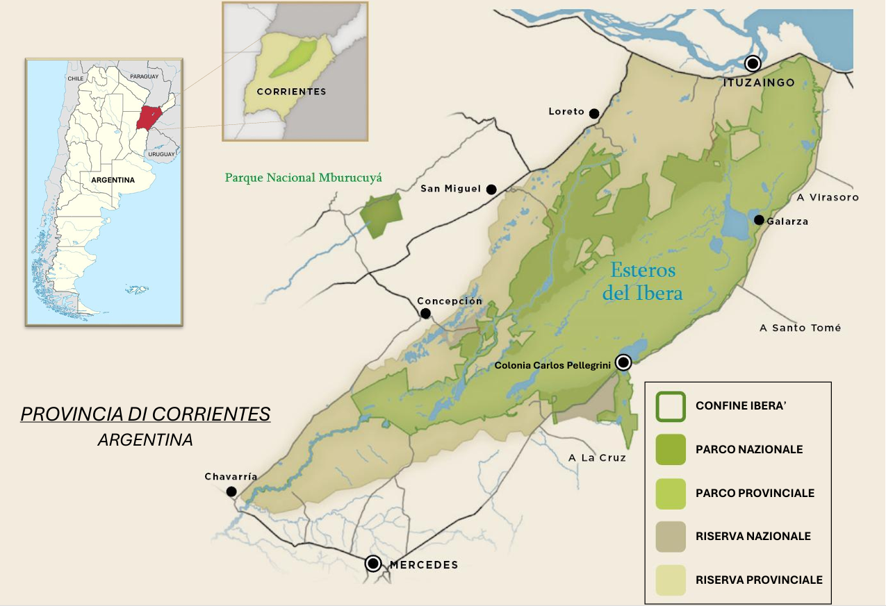
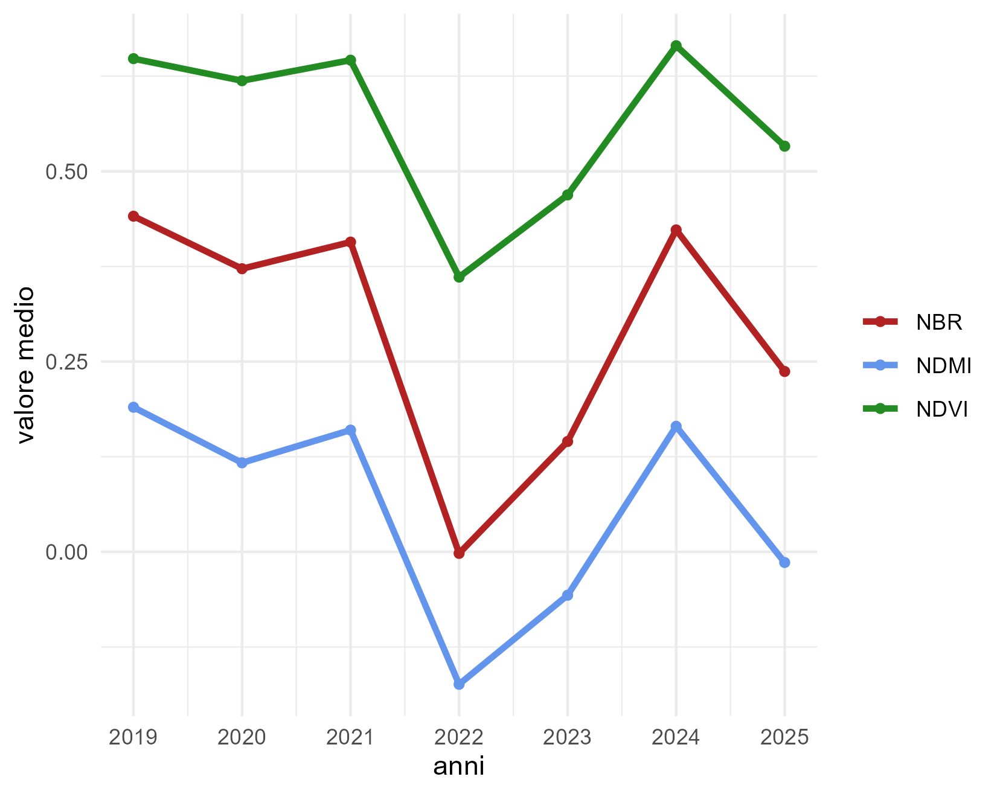
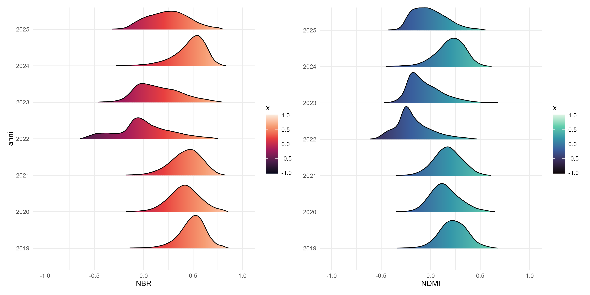
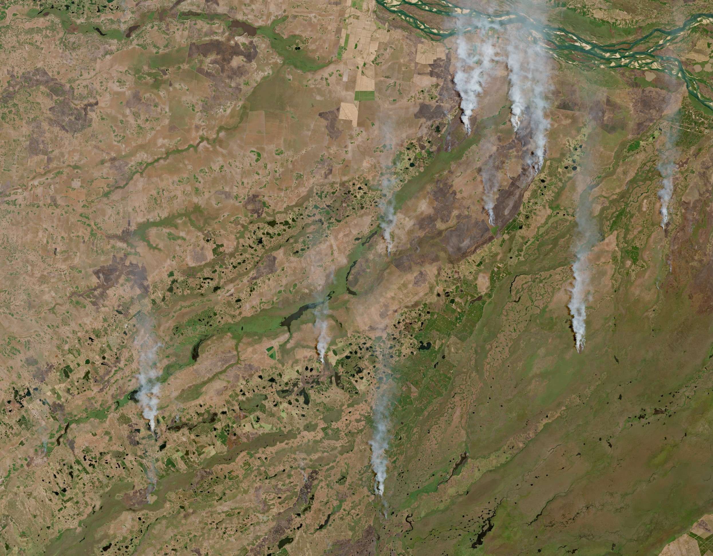
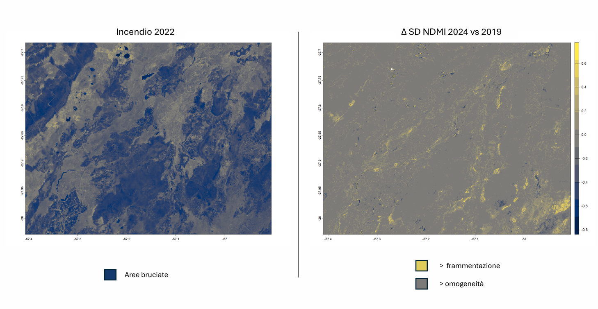

# Gli *Esteros del Iberá* tra siccità e incendi: analisi multitemporale delle dinamiche ambientali tra 2019 e 2025.



*Fonte: Fundación Rewilding Argentina*


## Area di studio

Areale nord della Provincia di Corrientes, Argentina.

Eco-regione degli *Esteros del Iberá*.

Superficie analizzata: ~ 24.000 km²



*Fonte: Municipalidad de Colonia Carlos Pellegrini*


## 1. Analisi multitemporale su indici spettrali

Periodo di riferimento dal 2019 al 2025: 
Febbraio (termine estate australe)
- Bassa nuvolosità: < 5%
- Picco biomassa
- Picco incendi

Le immagini multispettrali Sentinel-2 sono state acquisite dal [Copernicus Browser](https://browser.dataspace.copernicus.eu/?zoom=5&lat=50.16282&lng=20.78613&themeId=DEFAULT-THEME&demSource3D=%22MAPZEN%22&cloudCoverage=30&dateMode=SINGLE) 

### :fire: NBR (Normalized Burn Ratio)
Indice impiegato per identificare aree colpite da incendi e valutarne la severità.

Bande utilizzate: Infrarosso vicino (NIR) e Infrarosso a onda corta 2 (SWIR2)

```r
NBR = (NIR - SWIR2) / (NIR + SWIR2)
```

### :sweat_drops: NDMI (Normalized Difference Moisture Index)
Indice impiegato per valutare il contenuto idrico della vegetazione e condizioni di siccità.

Bande utilizzate: Infrarosso vicino (NIR) e Infrarosso a onda corta 1 (SWIR1)

```r
NDMI = (NIR - SWIR1) / (NIR + SWIR1)
```

### :deciduous_tree: NDVI (Normalized Difference Vegetation Index)
Indice impiegato per valutare lo stato di salute e densità della vegetazione.

Bande utilizzate: Infrarosso vicino (NIR) e Rosso visibile (RED)

```r
NDVI = (NIR - RED) / (NIR + RED)
```


**Pacchetti** utilizzati in R per condurre l'analisi:
```r
library(terra)      # Analisi e manipolazione di raster e dati geospaziali
library(imageRy)    # Visualizzazione e gestione di immagini raster
library(viridis)    # Palette di colori per ottimizzare la leggibilità grafica
library(ggplot2)    # Creazione di grafici basata su grammatiche visive
library(ggridges)   # Creazione di ridgeline plots per analisi della distribuzione
library(patchwork)  # Combinazione di più grafici ggplot2 in un unico layout
```


**Ciclo *for***: ottimizzazione calcolo degli indici 
```r
# Anni da processare
anni = c(2019, 2020, 2021, 2022, 2023, 2024, 2025)

for (anno in anni) {
  cat("Indici spettrali febbraio", anno, "\n")

# Percorso alle cartelle contenenti le bande
 path = file.path("C:/Users/feder/Desktop/IBERA'", as.character(anno), "geoTiff")

# Carico le bande con la funzione rast() del pacchetto terra
  red = rast(file.path(path, "B04.tiff"))
  nir = rast(file.path(path, "B08.tiff"))
  swir1 = rast(file.path(path, "B11.tiff"))
  swir2 = rast(file.path(path, "B12.tiff"))
  
# Calcolo degli indici
  ndvi = (nir - red) / (nir + red)
  ndmi = (nir - swir1) / (nir + swir1)
  nbr = (nir - swir2) / (nir + swir2)

# Calcolo le medie degli indici, eliminando eventuali NA 
  ndvi_mean = global(ndvi, fun = "mean", na.rm = TRUE)[1]
  ndmi_mean = global(ndmi, fun = "mean", na.rm = TRUE)[1]
  nbr_mean = global(nbr,  fun = "mean", na.rm = TRUE)[1]

 cat("✓ Indici salvati in:", out_dir, "\n")
}
```

### :chart_with_downwards_trend: LINE PLOT

Andamento delle medie spaziali degli indici nella serie temporale 2019 - 2025.

Grafico delle medie annuali mediante la funzione ggplot() del pacchetto ggplot2:
```r
line_plot = ggplot(medie, aes(x = Anno, y = Valore, color = Indice)) + geom_line(size = 1.2) + geom_point(size = 1.4) + labs(x = "anni", y = "valore medio", color=NULL) + scale_x_continuous(breaks = 2019:2025) + scale_color_manual(values = c( "NDVI" = "forestgreen", "NDMI" = "cornflowerblue", "NBR"  = "firebrick")) + theme_minimal() + theme(panel.background = element_rect(fill = "white", colour = NA),plot.background = element_rect(fill = "white", colour = NA))
```



FENOMENI CORRELATI AL TREND DEGLI INDICI:
- *La Niña*: 2020-2023, 2025
- *El Niño*: 2024
- Incendi: 2022, 2023, 2025

### :chart_with_upwards_trend: RIDGELINE PLOTS

Distribuzione e variabilità spaziale degli indici nel tempo.

Grafico della distribuzione di NBR, NDMI, NDVI mediante la funzione im.ridgeline() del pacchetto imageRy:
```r
Rnbr = im.ridgeline(nbr, scale=0.9, palette="rocket")
Rndvi = im.ridgeline(ndvi, scale=0.9, palette="viridis")   
Rndmi = im.ridgeline(ndmi, scale=0.9, palette="mako")
```
Distribuzione di NBR e NDMI a confronto, sfruttando il pacchetto patchwork:
```r
NBR_NDMI = Rnbr + Rndmi_mod
```




## 2. Analisi dell'impatto nel 2022

Variazione (Δ) NBR fra dicembre 2021 e febbraio 2022.

-1 < ΔNBR < 1

```r
dnbr = nbr.dic21 - nbr.feb22                        
```

Immagine *true color* del 7 febbraio 2022 :



*Fonte: Copernicus Browser*

- **IMPATTO LIEVE:  0.1 < ΔNBR < 0.27**
  
  ```r
  i_low = dnbr > 0.1 & dnbr <= 0.27                               # imposto il range
  pixel_low = global(i_low, fun = "sum", na.rm = TRUE)            # calcolo i pixel nel range
  pixel_tot = global(!is.na(dnbr), fun = "sum", na.rm = TRUE)     # calcolo i pixel totali
  perc_low = (pixel_low / pixel_tot) * 100                        # calcolo la percentuale
  ```

  = ***30 %*** della superficie analizzata*
  
- **IMPATTO MODERATO:  0.27 < ΔNBR < 0.44**

  ```r
  i_med = dnbr > 0.27 & dnbr <= 0.44
  pixel_med = global(i_med, fun = "sum", na.rm = TRUE)
  perc_med = (pixel_med / pixel_tot) * 100
  ```

  = ***19 %*** *
  
- **IMPATTO ELEVATO:  ΔNBR > 0.44** 

  ```r
  i_high = dnbr > 0.44
  pixel_high = global(i_high, fun = "sum", na.rm = TRUE)
  perc_high = (pixel_high / pixel_tot) * 100
  ```

  = ***24 %*** *

- **VEGETAZIONE RESIDUA** 

  ```r
  veg_res = (ndvi.feb22 > 0.3) & (ndmi.feb22 > 0) & (dnbr < 0.1)
  pixel_vegres = global(veg_res, fun = "sum", na.rm = TRUE)
  perc_vegres = (pixel_vegres / pixel_tot) * 100
  ```

  = ***11 %*** *


## 3. Analisi della variabilità spaziale post disturbo

Area N-O Riserva Iberá; superficie ~ 2.000 km²


**Δ SD NDMI**:

Studio della variazione della deviazione standard associata al NDMI fra 2024 e 2019  (-1 < ΔSD < 1)

Calcolo della sd locale mediante la funzione focal() del pacchetto terra, e successivamente del Δ sd:
```r 
sd_ndmi19 = focal(ndmi19, w=c(3,3), fun=sd, na.rm=TRUE)  
sd_ndmi24 = focal(ndmi24, w=c(3,3), fun=sd, na.rm=TRUE)

delta_sd_ndmi = sd_ndmi24 - sd_ndmi19
```

  
  - % area più frammentata: Δ SD NDMI > 0.05

    ```r 
    area_fram = delta_sd_ndmi > 0.05
    pixel_fram = global(area_fram, fun = "sum", na.rm = TRUE)
    pixel_tot = global(!is.na(delta_sd_ndmi), fun = "sum", na.rm = TRUE)
    perc_fram = (pixel_fram / pixel_tot) * 100
    ```

    = *11 %*
    
  - % area più omogenea: Δ SD NDMI < 0.05
        
    ```r 
    area_omog = delta_sd_ndmi < 0.05
    pixel_omog = global(area_omog, fun = "sum", na.rm = TRUE)
    perc_omog = (pixel_omog / pixel_tot) * 100
    ```

    = *89 %*

Confronto fra superfici incendiate nel 2022 ed evoluzione del territorio nel 2024:



